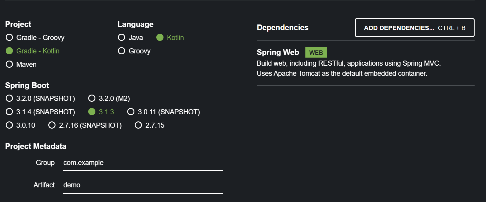

# Desenvolvimento de Ambientes de Execução

## Objetivo

- Dar competencias para desenhar e desenvolver aplicações HTTP

## Spring Introduction

- https://start.spring.io/
- Site para gerar projetos Spring Boot

## **Maven**

- Gerenciador de dependencias (artefactos)
- Permite criar um artefacto composto por JAR + metadata
  - ou seja, dizer quais são as dependências do artefacto
- Permite criar repositórios com artefactos, e fazer download de artefactos de repositórios
- Sistemas cliente que sabem usar o Maven, neste caso o **Gradle**

**Dependências transitivas**: App -> B1 -> B2 -> B3 - isto é resolvido pelo Maven automaticamente

## Exemplo Spring

- Annotação @SpringBootApplication - indica que é uma aplicação Spring Boot
  - Usada na classe principal da aplicação
- Annotação @RestController - indica que é um controlador HTTP
- Annotação @GetMapping - indica que o método é um handler para pedidos HTTP GET
- Annotação @RequestParam - indica que o parâmetro do método é um parâmetro de um pedido HTTP

- ExampleController **depends** on an implementation of GreetingsService
- Invervion of Control: 
  - ExampleController does NOT instantiate an implementation of GreetingsService
  - Instead, ExampleController **recieves** an implementation of GreetingsService

## Spring Context

- **Contentor de injeção de dependências** (Sprint Context) 
  - Cria instâncias de objetos pela ordem certas passando as dependências que são necessárias

- Inversão de controlo é uma tecnica de desenho.

- Injeção de dependencias é uma ação, de passar a dependência a quem precisa.
