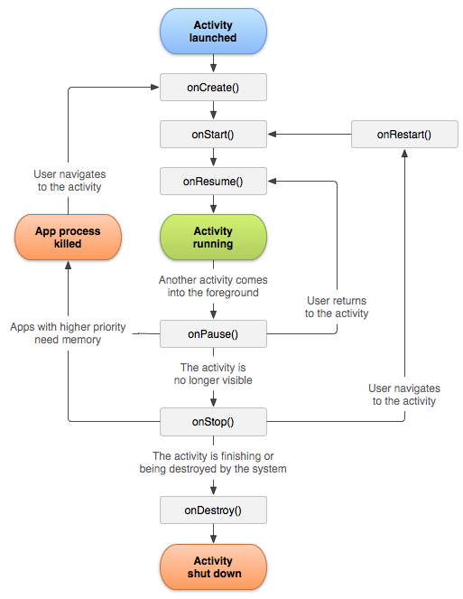

# A rever

Intent explicito vs implicito
Flows
Serviços com conecção à API
Activity lifecycle
User task back stack
Resources
Rembember, mutableState, rememberSaveable, combinação de ambos
okHttp
Firebase

## Manifesto

Dá indicação no momento da instalação do APK, os requesitos e a carga do mesmo:

Indica:
  
- Componentes (e.g. Activities)
- Indicar as permissões necessárias
- Indicar o nome completo da classe derivada de Application a ser instanciada
- Entre outros.

## Resources

Facilita a adequação da aplicação a diferentes dispositivos, e.g.:

- drawables (e.g. imagens)
- layouts (e.g. XML)
- values (e.g. strings, cores, dimensões, estilos, etc.)
- mipmaps (e.g. imagens para ícones)
- anim (e.g. animações)

## Intent Filters (Explicit vs Implicit)


- Para incluir instâncias de tipos definidos pela aplicação como extras de intent, a mesma deve cumprir o contrato Parcelable.
- Se for um tipo primitivo não é necessário cumprir o contrato.

@Parcelize não vem por default mas sim é uma tool que se instala no gradle.

- Intent Implicito é uma forma de garantir interoperabilidade entre aplicações, e.g. enviar um email ou abrir um link no browser, sem saber qual a aplicação que vai ser utilizada para o efeito. **É imprescindível a definição de, pelo menos, um intent filter no manifesto da aplicação de destino**
  - Intent filter têm 3 tipos de informação:
    - Action: ação a ser executada
    - Data: tipo de dados a ser manipulado
    - Category: categoria de componente que pode manipular o intent
  - Um exemplo de um Intent Filter é a que temos de meter no manifesto para poder estar no home screen do android.
- Intent Explicito é uma forma de garantir que a ação é executada por uma aplicação específica, e.g. abrir uma atividade. **Não é necessário a definição de intent filters no manifesto da aplicação de destino**
  - Isto acontece quando vamos lançar uma activity da nossa activity.

## Funções importantes


- remember - guarda o estado da variável entre recomposições, caso exista uma recomposição, a expressão não é reavaliada.
- Uma função composable não pode ter side-effects, para isso utiliza-se o LaunchedEffect.
- LaunchedEffect - permite executar side-effects. Recebe uma key, se a key mudar, o efeito é cancelado e recriado. O código lá dentro é uma corrotina.
- Para que apareça na UI a alteração, temos de forçar uma recomposição, isto faz-se com o mutableStateOf, que é uma variável que quando é alterada, força uma recomposição.
- rememberSaveable - assim como o remember guarda o estado da variável entre recomposições, porém sobrevive também a reconfigurações (e.g. rotação do dispositivo).

> Cada pergunta vale 20/16, cada errada desconta 0.41, mais o 1.25 por a pergunta estar errada, 1.66

## Activity and View Model Lifecycle



- o tempo de vida do VM é superior ao da activity, logo uma dependência do VM para a activity deve alertar para que algo não está bem, por poder causar memory leaks.

    ```kotlin
    class SomeViewModel: ViewModel() {
        var stuff by mutableStateOf("")
        fun fetchStuff() {
                //Fetches stuff (a string) from a remote API and publishes it to the stuff property
        }

        fun fetchMoreStuff(callback: (String) -> Unit) {
                //Fetches stuff (a string) from a remote API and publishes it to the callback
        }
    }
    ```

## okHttp

- execute - faça-se o pedido e espere-se pela resposta, bloqueando. sincrono e bloqueante
- enqueue - recebe um callback e quando a resposta chegar, o callback é chamado. assincrono e não bloqueante
- okHttp ainda não tem suporte para suspending functions.

## http4k


## Firebase

- Tem suporte parcial para suspending functions com o await, que suspende sem bloquear, logo pode ser feito na main thread.
  