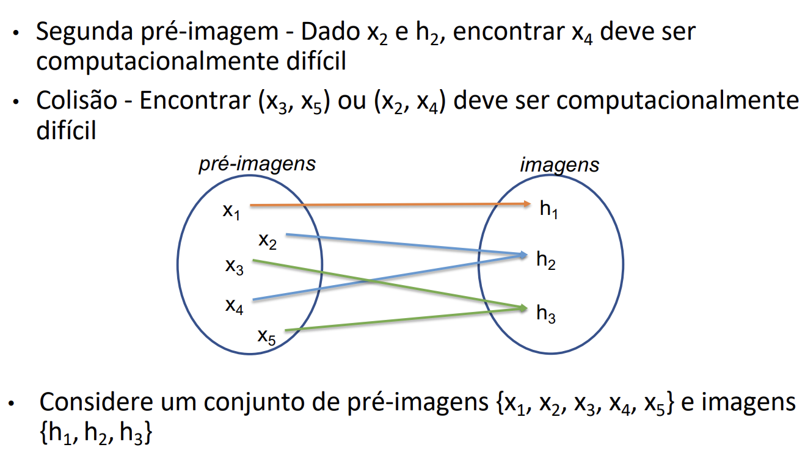

# Funções de hash

A função SHA256 tem 2^256 imagens possíveis.

- **segunda pré imagem** - Dado um valor **x**, encontrar um valor **y** tal que **h(x) = h(y)** e **x != y**.
- **colisão** - Encontrar dois valores **x** e **y** tal que **h(x) = h(y)** e **x != y**.
- Ambos devem ser computacionalmente difíceis.

