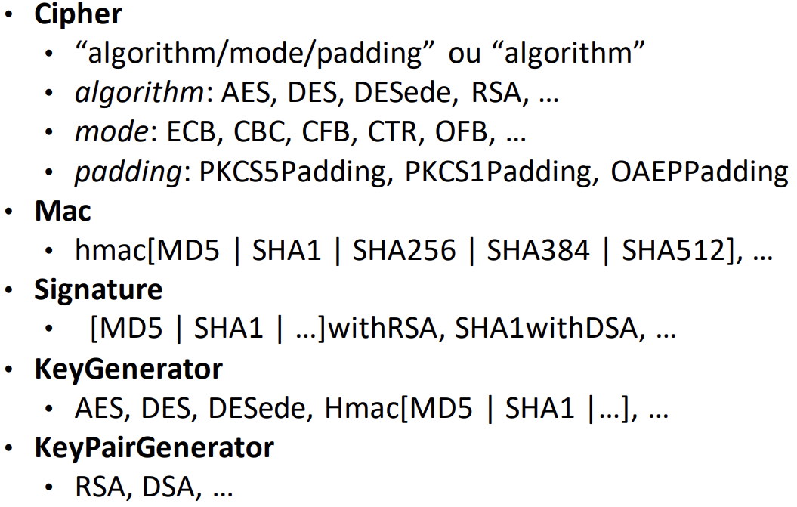

# Java Cryptography Architecture (JCA)

## Princípios de desenho

- Independência dos algoritmos e expansibilidade
  - Utilização de esquemas criptográficos, como a assinatura digital e a cifra simétrica, independentemente dos algoritmos que os implementam
  - Isto concrediza-se através do uso de factories e providers no JCA. 
  - Por exemplo, paara criar uma instância de uma classe Cipher, usamos o método getInstance, que recebe como parâmetro o nome do algoritmo a usar.
  - Capacidade de acrescentar novos algoritmos para os mecanismos criptográficos considerados
- Independência da implementação e interoperabilidade
  - Várias implementações para o mesmo algoritmo
  - Interoperabilidade entre várias implementações
    - Por exemplo, assinar com uma implementação e verificar com outra
  - Acesso normalizado a características próprias dos algoritmos

### Classe Cipher

metodo init da classe Cipher tem os parâmetros: mode, key, params and iv

#### Métodos de cifra

- update: byte[] -> byte[] - continua a operação incremental (recebe parte da mensagem e retorna parte do criptograma)
- doFinal: byte[] -> byte[] - termina a operação incremental (recebe o final da mensagem e retorna o final do criptograma)
- wrap: Key -> byte[] - cifra uma chave
- unwrap: byte[] -> Key - decifra uma chave

#### Métodos auxiliares de cipher

- byte[] getIV() - devolve o IV
- AlgorithmParameters getParameters() - devolve os parâmetros
- ...

### Interface Key

- String getAlgorithm() - devolve o algoritmo
- byte[] getEncoded() - devolve a representação da chave
- String getFormat() - devolve o formato da chave

#### Interfaces SecretKey, PublicKey e PrivateKey estendem a interface Key, não acrescentando nenhum método.

Classe KeyPair, contém um par de chaves (pública e privada) (PublicKey e PrivateKey)
Geração através das engine classes KeyPairGenerator e KeyGenerator

### Classe Mac

- init, parâmetros: key, params

#### Métodos de geração de marca

- update: byte[] -> void - continua a operação incremental 
- doFinal: byte[] -> byte[] - termina a operação incremental, retornando a marca

#### Métodos auxiliares de Mac

- int getMacLength() - devolve o tamanho da marca
- ...

### Classe Signature

- initSign, parâmetros: private key and random generator
- initVerify, parâmetros: public key

#### Métodos de geração de assinatura

- update: byte[] -> void - continua a operação incremental
- sign: void -> byte[] - termina a operação incremental, retornando a assinatura

#### Métodos de verificação de assinatura

- update: byte[] -> void - continua a operação incremental
- verify: byte[] -> boolean - termina a operação incremental, retornando true se a assinatura é válida

