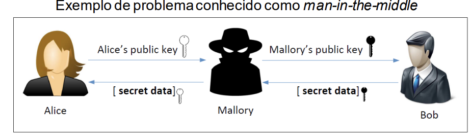

# Certificados (por fazer)

## Certificados

- Se Bob usar as chaves públicas de Mallory como sendo de Alice
  - Mallory pode decifrar as mensagens enviadas para alice, ou 
  - Mallory pode modificar mensagens de Alice e assinar com a chave privada de Mallory
- As chaves públicas tem de ter garantia de autenticidade
  - Certificados: Associação autenticada entre identidade e chave pública.

## Certificados X.509

- Quem certifica (emissor): Autoridade de Certificação (CA)
- O que certifica: associação entre uma chave pública e um nome (identidade)
- Outros atributos - validade, uso da chaves, extensões
- Assinatura do emissor - assinatura digital realizada com a chave de assinatura (privada) do emissor

Para verificar a assinatura de um certificado é preciso a chave pública do emissor.

### Caminho de certificação

- Raiz de confiança
  - Certificado auto-assinado
  - Instalado explicitamente no sistema.

- Recursão
  - Obter chave pública => validar certificado => obter chave pública (do emissor)

- Condição de paragem
  - Trust anchor - certificado auto-assinado (emissor == sujeito)

## Perfil PKIX

- Introduzido através da versão 3 do X.509

- Algumas extensões:
  - Key Usage - uso da chave
  - Alternative Name - nome alternativo
  - Basic Constraints - restrições ao uso do certificado
  - CRL Distribution Points - localização da lista de certificados revogados

Key Store - armazena chaves e certificados

3 Tipos de entrada:

- Chaves privadas e certificados associados
- Chaves simétricas
- Certificados representando trust anchors

- Proteção baseada em passwords
  - Integridade de todo o repositório - uma password por repositório.
  - Confidencialidcade das entradas contendo chaves privadas ou secretas
    - Uma password por entrada do repositorio

Cada entrada tem associado um alias, do tipo String
Interface base Entry

- **PrivateKeyEntry** - Chaves privadas e certificados associados
  - ctor(PrivateKey, Certificate[])
  - Certificate getCertificate()
  - Certificate[] getCertificateChain()
  - PrivateKey getPrivateKey()
- **SecretKeyEntry** - Chaves simétricas
  - ctor(SecretKey)
  - SecretKey getSecretKey()
- **TrustedCertificateEntry** - Trust anchors
  - ctor(Certificate)
  - Certificate getCertificate()
