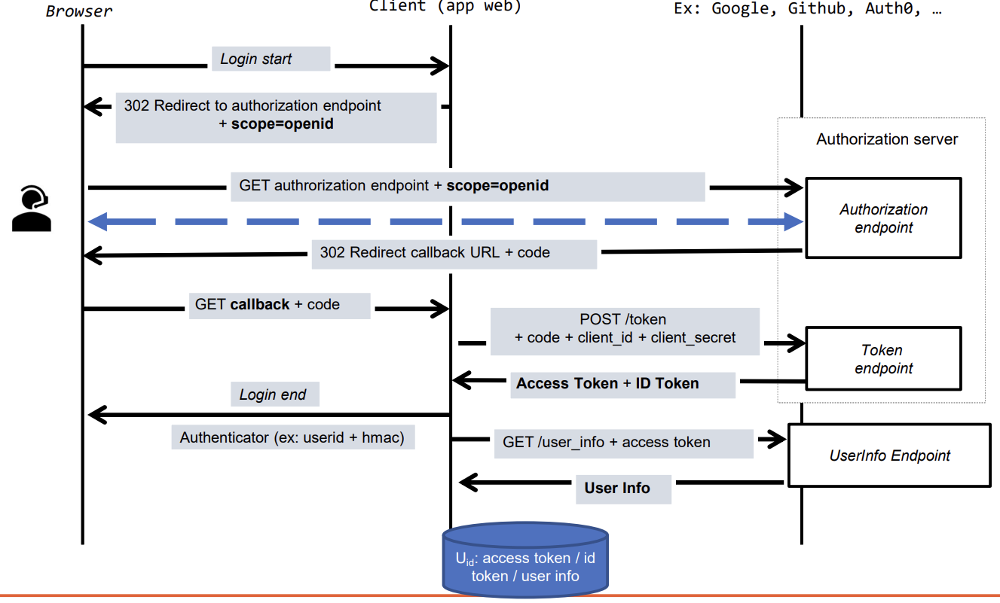
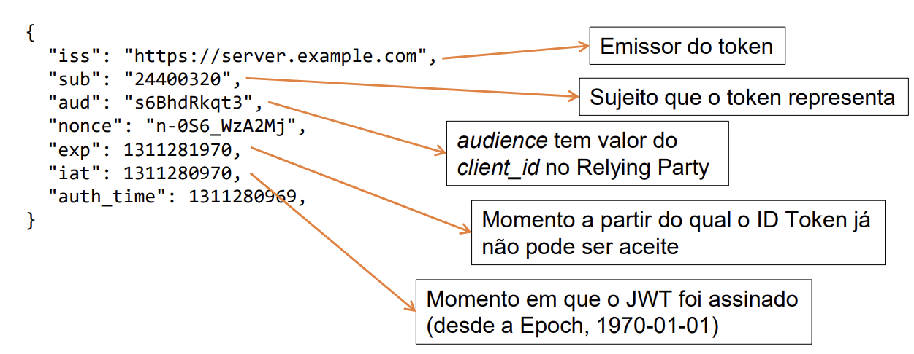

# OpenID Connect

## Participantes

- Utilizador (End-user)
  - Utilizador humano que pretende aceder a um serviço na aplicação cliente
  - A aplicação cliente apenas forneçe o serviço a utilizadores autenticados
  - Caso prático com utilizador a aceder via browser
- Aplicação cliente (Relying Party)
  - Aplicação cliente que fornece o serviço
  - Delega no fornecedor de identidade a autenticação do utilizador
- Fornecedor de identidade (Identity Provider)
  - Guarda registo do utilizador e da sua informação de autenticação (password, certificado, ...)
  - Guarda registo de aplicações cliente que pretendam autenticar utilizadores

## ID Token

- ID token é um conjunto de asserções sobre um utilizador autenticado
- JSON Web Token (JWT) assinado pelo fornecedor de identidade

## Recurso UserInfo

- A informação sobre um utilizador autenticado pode ser obtida através do UserInfo Endpoint
- Representada através de um objeto JSON
  - Se assinada/cifrada será um JWT
