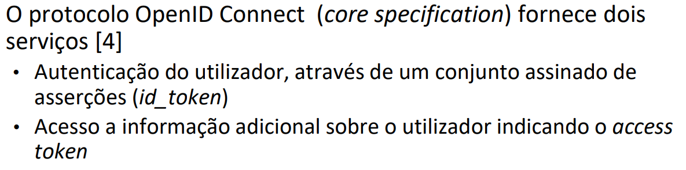

# OAuth 2.0

- A framework OAuth 2.0 tem como objetivo delegar autorização condicionada
- O dono de recurso autoriza o acesso temporário a um conjunto pré-determinado de recursos

## Papéis

- Proprietário do recurso (Resource owner)
  - Uma entidade capaz de conceder acesso a um recurso protegido
  - Quando o proprietário de recurso é uma pessoa, é referenciado como um end-user
- Servidor de recurso (Resource server)
  - O servidor que hospeda recursos protegidos, capaz de aceitar e responder a requisições de recursos protegidos usando access tokens
- Cliente (Client)
  - Uma aplicação que requisita recursos protegidos através do proprietário de recurso e com sua autorização
- Servidor de autorização (Authorization server)
  - O servidor que emite access tokens para o cliente depois de autenticar o proprietário de recurso e obter autorização

Os clientes têm de se registar no servidor de autorização, sendo-lhes atribuído um client_id. Para alguns é também atribuído um client_secret, usado pelo cliente no servidor de autorização
Dois tipos de clientes, confidenciais e públicos. Os confidenciais são capazes de manter o client_secret em segredo, enquanto os públicos não.

- O access token representa uma credencial de acesso
  - Os clientes acedem aos recursos protegidos indicando um access token
  - O servidor de recursos usa-o para aplicar políticas de acesso
  - São strings opacas para os clientes

A framework prevê 4 cenários (grant flows) para a obtenção de um access token:

- **Client Credentials**: Autorização é dada somente com base nas credenciais do cliente (client_id e client_secret)
- **Resource owner password**: Autorização é dada com base na password do utilizador.
  - A aplicação cliente não precisa de persistir a password
  - Deve apenas ser usado quando há um nível elevado de confiança entre o dono de recursos e a aplicação cliente.
- **Authorization code**: Código de autorização obtido pelo dono dos recursos e entregue ao cliente para que este obtenha o access token.
  - A password do dono dos recursos não é visível para o cliente
  - Não define forma do dono de recursos se autenticar e dar consenso para o cliente aceder ao recurso
- **Implicit**
  - Token de autorização (code) é entregue à aplicação cliente por redireção do user-agent.

A mensagem de obtenção do access_token vem com o content type do tipo application/x-www-form-urlencoded
client_id e client_secret são o username e password, respetivamente.

## Front channel e Back channel

- Front channel
  - Termo usado para designar o canal de comunicação client -> authorization endpoint, via redireção do user-agent
  - Em caso de erro a resposta tem sempre de ser enttregue via redirect
  - O client_secret nunca passa pelo front channel
  - Usando o front channel como é que o cliente estabelece uma relação entre pedido e resposta? Usa o state
- Back channel
  - Termo usado para designar o canal de comunicação client -> token endpoint
  - Usa mensagem POST HTTP e os respetivos códigos de erro
  - HTTP Basic authentication com username (client_id) e password (client_secret)

