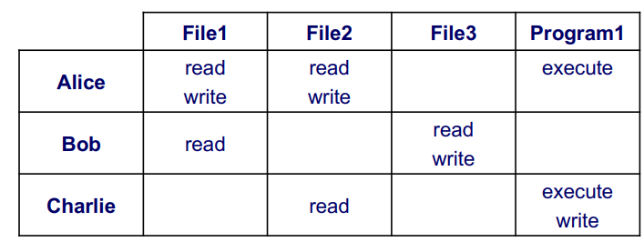
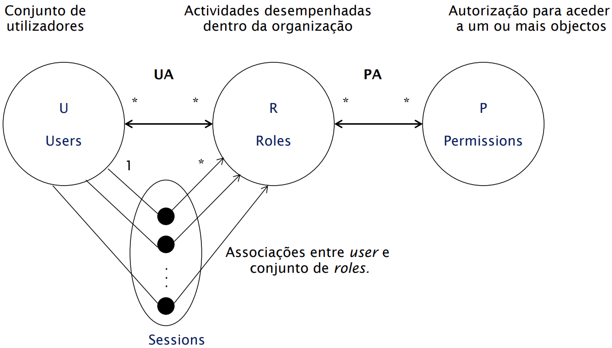

# Modelos e políticas para controlo de acessos

- Base: RBAC0
- Hierarquia de roles: RBAC1
- Restrições: RBAC2
- Unificação (Hierarquia e restrições): RBAC3

## Monitor de referências

- Policy Enforcement Point (PEP): 
  - Não deve ser possível alterá-lo
  - Não deve ser possível contorná-lo
  - Deve ser pequeno e estar confinado ao núcleo de segurança do sistema por forma a facilitar a verificação da sua correção.

- Policy Decision Point (PDP):

## Elementos do sistema de controlo de acessos

Modelo de segurança: Formalização da forma de aplicação das políticas de segurança.

Política de segurança: define as regras do controlo de acessos

Mecanismos de segurança: software/hardware: funções de baixo nível que dão suporte à implementação de modelos e políticas de segurança

- PEP depende dos mecanismos de segurança
- PDP depende da política e modelo de segurança

## Modelo Matriz de acessos

- Matriz de acessos define um triplo (S,O,A) onde:
  - S é o conjunto de sujeitos
  - O é o conjunto de objetos
  - A é o conjunto de operações
  - Mso é a matriz de operações, onde as linhas representam os sujeitos, as colunas os objetos e cada entrada as permissões do sujeito s sobre o objeto o.

- Vantagens:
  - Facilidade na obtenção das permissões associadas a um sujeito
  - Em ambientes distribuídos elimina a necessidade de múltiplas autenticações
- Desvantagens:
  - Para obter lista de acessos a objetos obriga a pesquisar todas as capacidades
  - Possibilidade de cópia e uso fraudulento

## Modelos RBAC 

### Motivação

- Para efeitos de controlo de acessos é mais relevante saber as responsabilidades do utilizar do que quem é o utilizador
- As permissões associadas a roles mudam com menos frequência do que a associações entre utilizadores e roles
- As organizações valorizam princípios como o da separação de poderes
  - Quem pede material para projetos não deve ser a mesma pessoa que autoriza o pagamento

UA - User Assignment, associação entre utilizadores e roles
PA - Permission Assignment, associação entre roles e permissões

### RBAC1

- Introduz o conceito de hierarquia de roles
- O utilizador escolhe o role a ativar, e herda os roles júnior desse, juntamente com as suas permissões

### RBAC2

- Introduz o conceito de restrições
- Restrições são um mecanismo para impor regras da organização
- Têm a forma de predicados, retornando "aceite" ou "não aceite"
- Exemplos:
  - Separação de deveres
    - Pode ser garantido de forma estática (relação UA) ou dinâmica (função roles)
  - Cardinalidade
  - Pré-requisitos

## RBAC Notas

- Um role representa um conjunto de permissões e não um conjunto de utilizadores
- Os utilizadores escolhem qual role pretendem desempenhar
- O modelo suporta cenários simples e complexos

### Algumas limitações

- "Explosão" de roles
  - As particularidades dos utilizadores dão origem a papéis com apenas alguns membors, contribuindo para o aumento de papéis
- Efeitos indesejados da herança de roles
  - Estruturar e gerir as hierarquias de papéis requer um compreensão da herança de permissões para evitar efeitos colaterais inesperados que resultem em sub ou excesso de permissões
- Falta de interoperabilidade
- Rigidez