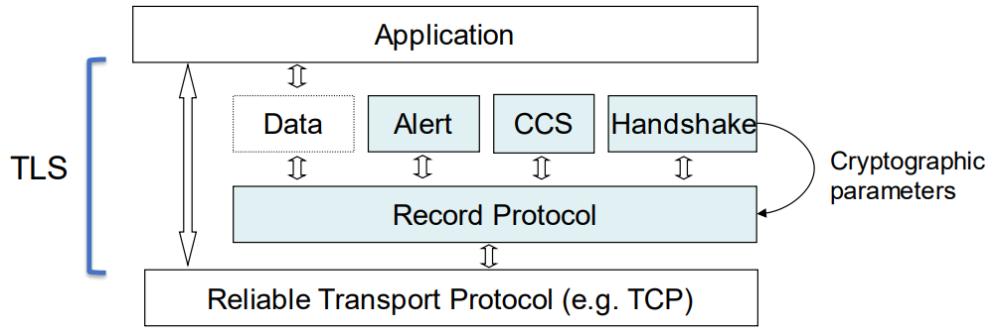
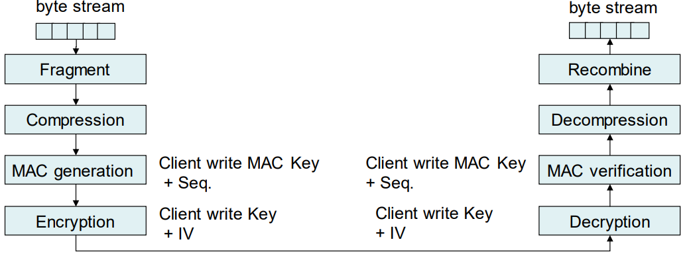
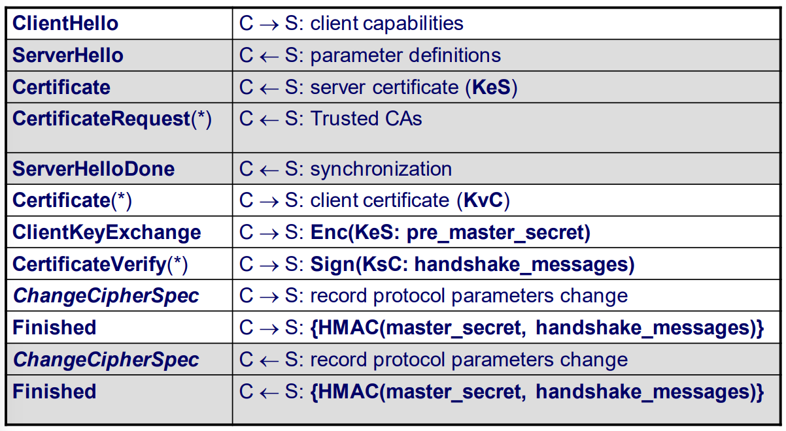

# TLS

- TLS é um protocolo que fornece um canal seguro entre dois endpoints. O canal seguro tem três propriedades:
  - **Confidencialidade** - A informação trocada entre os dois endpoints não pode ser lida por terceiros.
  - **Integridade** - A informação trocada entre os dois endpoints não pode ser alterada por terceiros.
  - **Autenticação** - Pelo menos um dos endpoints tem de ser autenticado para que o outro endpoint tenha garantias sobre a quem está ligado.

- TLS requer uma camada de transporte fiável, como TCP.
- O TLS cifra e autentica os dados que envia/recebe da camada de transporte
- TLS fica entre a camada de aplicação e a camada de transporte

- Dividido em dois subprotocolos principais:
  - **Record**
  - **Handshake**

## Record Protocol

- Fragmenta, comprime, autentica (MAC) e depois cifra
- A mesma ligação TCP, duas direções independentes de dados
  - Chaves, IVs e números de sequência diferentes (client write, server write)
  

A compressão é opcional.

### Notas sobre o record protocol

- Repetições de mensagens
  - Detetadas pelo número de sequência
- Reflexão da mensagem
  - Chaves MAC separadas para cada direção
- Reutilização de keystream(criptografia simétrica baseada em streams)
  - Chaves de criptografia e IVs separados para cada direção
- Análise de tráfego
  - Chaves de criptografia separadas

## Esquemas criptográficos

- Os esquemas criptográficos usados dependem do cipher suite acordado.
- O cipher suite e os algoritmos de compressão são negociados pelo protocolo de handshake.
- Exemplos
  - TLS_NULL_WITH_NULL_NULL
  - TLS_RSA_WITH_3DES_EDE_CBC_SHA
  - TLS_RSA_WITH_RC4_128_SHA 
- Um cipher suite define
  - A função de hash usada pelo HMAC (ex: SHA)
  - O esquema simétrico (e.g. 3DES_EDE_CBC or RC4_128)
    - Suporta modos de bloco ou stream
  - Esquema de estabelecimento de chaves (RSA or DH)

## Handshake Protocol

- Responsável por 
  - Negociar os parâmetros de operação
  - Autenticação dos endpoints
  - Estabelecimento de chave segura
- Autenticação de entpoint e estabelecimento de chave segura são opcionais
  - Suporta várias técnicas criptográficas como por exemplo o transporte de chave com por exemplo RSA ou acordo de chave com por exemplo DH
- Cenário típico HTTPS
  - Transporte de chaves baseado em RSA usando certificados X.509
  - Autenticação de servidor obrigatória
  - Autenticação de cliente opcional

### Resumo

- Quando é usado RSA para transporte de chave
  - C <-> S: negociação dos algoritmos a sererm usados
  - C <- S: certificado do servidor
  - C -> S: segredo aleatório cifraco com a chave pública do servidor
  - C <- S: prova da posse do segredo aleatório

- Se for necessário autenticação do cliente
  - C <- S: O servidor solicita o certificado do cliente
  - C -> S: O cliente envia o seu certificado
  - C -> S: Prova de posse da chave privada, analisando as mensagens anteriores.

### Perfect forward secrecy

- A troca de chaves com RSA implica que o browser usa a chave pública do servidor para cifrar o pre master secret.
  - O servidor decifra o pre master secret usando a chave privada.
- Este processo é seguro e garante confidencialidade do pre master secret
- O que acontece se a chave privada for comprometida?
  - O pre master secret dos handshakes seguintes e dos anteriores (guardados pelo atancante) podem ser decifrados
  - Perfect forward secrecy é a propriedade do handshake que garante que, se a chave privada for comprometida, não é possível decifrar master secret anteriores (e consequentemente não é possível decifrar mensagens do record protocol)

## Master Secret 