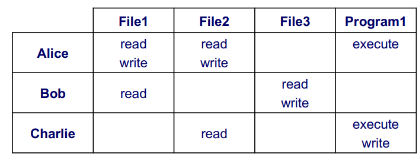

# Modelos e políticas para controlo de acessos

## Monitor de referências

- Policy Enforcement Point (PEP): 
  - Não deve ser possível alterá-lo
  - Não deve ser possível contorná-lo
  - Deve ser pequeno e estar confinado ao núcleo de segurança do sistema por forma a facilitar a verificação da sua correção.

- Policy Decision Point (PDP):

## Elementos do sistema de controlo de acessos

Modelo de segurança: Formalização da forma de aplicação das políticas de segurança.

Política de segurança: define as regras do controlo de acessos

Mecanismos de segurança: software/hardware: funções de baixo nível que dão suporte à implementação de modelos e políticas de segurança

- PEP depende dos mecanismos de segurança
- PDP depende da política e modelo de segurança

## Modelo Matriz de acessos

- Matriz de acessos define um triplo (S,O,A) onde:
  - S é o conjunto de sujeitos
  - O é o conjunto de objetos
  - A é o conjunto de operações
  - Mso é a matriz de operações, onde as linhas representam os sujeitos, as colunas os objetos e cada entrada as permissões do sujeito s sobre o objeto o.

- Vantagens:
  - Facilidade na obtenção das permissões associadas a um sujeito
  - Em ambientes distribuídos elimina a necessidade de múltiplas autenticações
- Desvantagens:
  - Para obter lista de acessos a objetos obriga a pesquisar todas as capacidades
  - Possibilidade de cópia e uso fraudulento